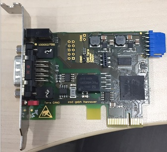
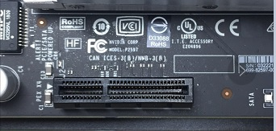
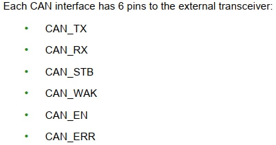
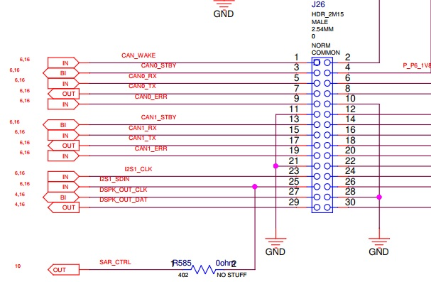
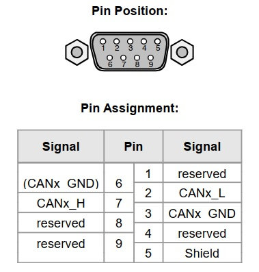
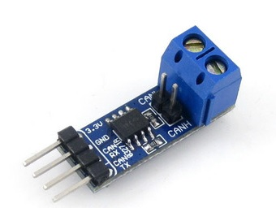
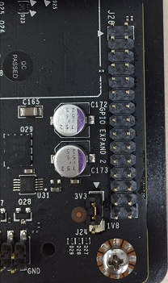

### ESD CAN尝试
Apollo官方推荐的can卡为ESD CAN-PCIe/402，官方网站为[https://esd.eu/en/products/can-pci402](https://esd.eu/en/products/can-pci402)。
在TX2上试用的can卡型号为ESD CAN-PCIe/402-1-LP，展示图为；
  

该型号通过PCIe插槽和TX2通讯，TX2上的PCIe插槽的展示图为：
  

经过验证，该型号的can卡的驱动并不支持arm64，所以无法使用该型号的can卡作为TX2和canbus通讯的接口。

### TX2已经验证的can通讯方法的硬件接入方案。
参考TX2的[Techinical Reference Manual(TRM)](https://developer.nvidia.com/embedded/downloads#?tx=$product,jetson_tx2)，
章节35中对can控制器的介绍，TX2默认支持2个can控制器，分别标记为can0和can1。并且TX2需要外接can接收器才能和canbus进行通讯。
TX2提供了6个pins用于输入输出信号：

其中CAN_RX和CAN_TX分别用于输入和输出can信号。

关于上图中标识的CAN_RX和CAN_TX，我们需要在TX2裸露的板子上找到对应的引脚。
根据TX2官方提供的TX2技术文档[Jetson TX1-TX2 Developer Kit Carrier Board Design Files ](https://developer.nvidia.com/embedded/downloads#?tx=$product,jetson_tx2)，
其中文档P2597_C02_OrCAD_schematics.pdf第16页中有对CAN_RX和CAN_TX引脚的标注，该引脚隐藏在标号为J26的排序中：

从上图中可知，引脚5,7分别对应于CAN_RX和CAN_TX。

既然已经找到了CAN_RX和CAN_TX的引脚，我们需要再考虑如何将信号发送到canbus上。

根据ESD CAN技术文档对canbus接口的描述：

引脚2和7分别对应于L和H信号。而将CAN_RX和CAN_TX转换为L和H信号的任务将由can接收器来完成。

下图展示了在TX2社区中已经验证的can接收器SN65HVD230：

可以看到，can接收器的一端接CAN_RX和CAN_TX，另外一端接H和L。那么使用[杜邦线](https://baike.baidu.com/item/%E6%9D%9C%E9%82%A6%E7%BA%BF)将TX2、can接收器和canbus接口连接在一起
就可以实现TX2和canbus的通讯了。

关于J26排线在TX2的具体展示，及引脚的编号，我们在下图中看一看：

根据确认（猜测），其中箭头指向的是编号0。

未完待续。。。 。。。
